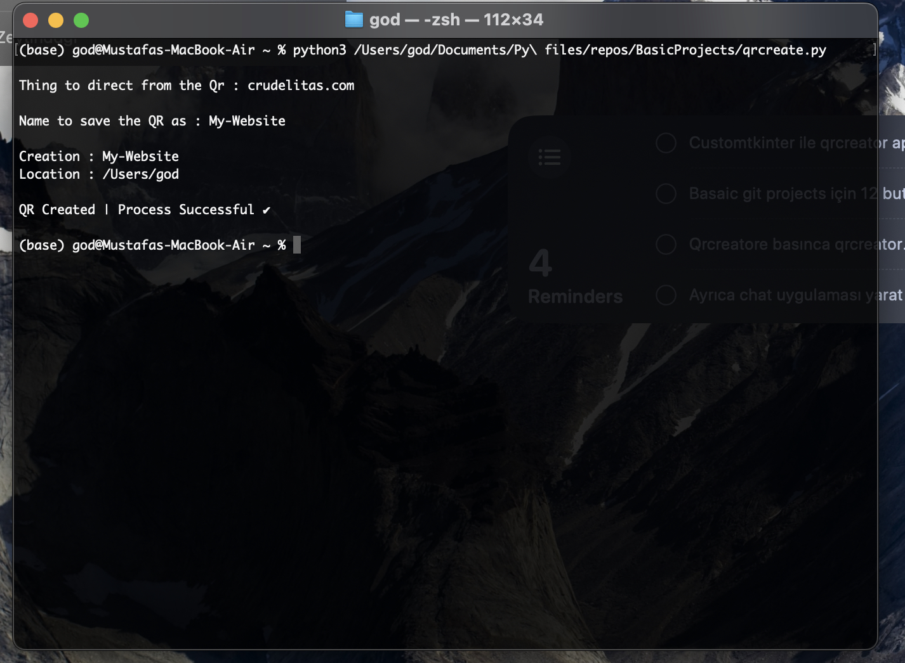

# Qr-Creator

## Clone

    git clone https://github.com/OldKokoroz/Qr-Creator.git

## Requirements

    pip install -r requirements.txt

## Usage 

Program needs 2 inputs :

1 - Data to put in the Qr (Such as your website, a secret message maybe...)

2 - Name to save the Qr as

